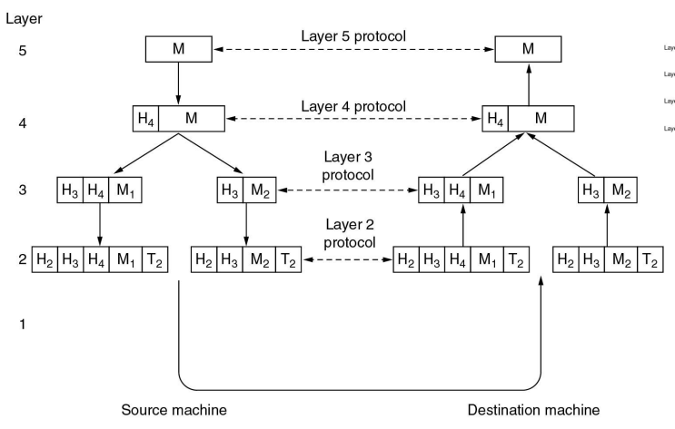

# 1 - Introduction of Computer Networks

As redes de computadores são utilizadas por diversos fins no nosso quotidiano (email, web, remote login, games, vídeos, streaming).  
Há, para isso, duas arquiteturas de aplicações principais:

## Application Architectures

### 1 - Client-server

O cliente comunica diretamente com o servidor (um always-on computer) mas não com outros clientes. O servidor têm um IP permanente e um nome conhecido. Um exemplo é a comunicação entre browsers e servidores, através de HTTP requests.

### 2 - Peer-to-peer (P2P)

Não há um servidor always-on mas sim sistemas arbitrários para comunicar diretamente (tal como outros clientes). Um exemplo é a distribuição de ficheiros: há torrent, que é um grupo de pessoas que partilham partes de um ficheiro, e o servidor, que é um tracker que controla quem faz parte do torrent.

## Tipos de Redes

As redes podem ser classificadas de acordo com a área/extensão de atuação:

1. **PAN - Personal Area Network**, 1 metro, bluetooth entre dispositivos de uma secretária;
2. **LAN - Local Area Network**, 10 metros a 1 quilómetro, no quarto, construção ou campus. É exemplo a rede da FEUP, que tem switches, routers e access points;
3. **MAN - Metropolitan Area Network**, 10 quilómetros, onde pode conter uma antena e servidores;s, protocols, an
4. **WAN - Wide Area Network**, engloba um continente;
5. **Internet - no Planeta**, é um conjunto de redes conectadas;

## Protocol Stacks

A comunicação entre dois ou mais Hosts é feita segundo um modelo de black box. As camadas superiores usam as APIs dadas pelas camadas inferiores para criar o seu protocolo.

    
    
Figura 1: Layers

Cada camada trata de criar headers próprios para que a informação contida em cada pacote seja correctamente identificada e transportada. É comum nos serviços existirem 5 camadas principais para transferência da informação:

1. **Application layer**: suporta a aplicação propriamente dita. É a camada mais externa da transferência. São exemplos o FTP, SMTP, HTTP.
2. **Transport layer**: Process-process / end-to-end. Como os protocolos TCP, UDP.
3. **Network layer**: roteamento dos pacotes desde a fonte para o destino. Por exemplo os IP.
4. **Data Link layer**: informação transferida entre os elementos das redes vizinhas. São exemplos PPP, Ethernet e WLAN.
5. **Physical layer**: os bits que são transferidos.

## Transferência da informação:

### Circuit Switching

A comunicação é só feita após uma ligação bem estabelecida entre a fonte e o receptor (e entre os intermediários). Após isso os dados são enviados de uma vez. Há um delay no início para estabelecimento da ligação.

### Packet Switching

A informação está concebida em pacotes que são enviados sequencialmente entre todos os intermediários e segundo a ordem da fila. 