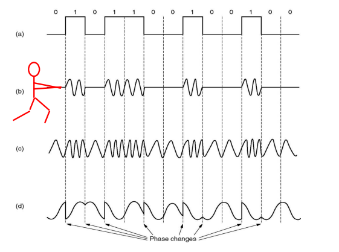

# Physical Layer

São os canais reais usados na rede para transmitir e receber dados digitais. O sinal de transmissão de input pode ser modificado até ao receptor, com uma frequência que varia entre zero e o valor máximo BH. Um sinal também é composto por um número variado de ondas harmónicas. 

## Reconstrução do sinal no receptor

Nyquist provou que é possível reconstruir totalmente um sinal no receptor desde que exista uma banda BH e amostrado na taxa de 2B por segundo. Amostragem em taxa mais alta não fornece informações adicionais. A fórmula a reter é bitrate C = 2BH * log (M)

### Exemplo:

Uma onda quadrada tem diferença de potencial que varia entre 5v e -5v (M = 2). A frequência do canal é de BH = 3kHz. Então deverá receber 2BH símbolos por segundo, ou seja, 6k, com cada símbolo a ser um bit de informação. 

Se M = 4, ou seja, há 4 níveis de diferença de potencial para enviar a informação, então o bitrate é 6k * log (4) = 12 kbits/s.

### Bandas

1. **Baseband**: O sinal tem uma frequência de zero até a um limite BH. É comum para fios;
2. **Passband**: O sinal usa uma banda de frequências em torno de uma frequência fixa FC. Comum para canais sem fio e óticos.

## Transmissão em BaseBand

1. **NRZ-L, Non Return to Zero Level**, há dois níveis, o mais baixo representa o 1;
2. **NRZ-I, Non Return to Zero Inverted**, há também dois níveis, mas a mudança de nível representa um 1;
3. **Manchester**, a transmissão é no meio do bit. Se descer é um 1, se subir é um 0. É muito usada na Ethernet. 

### Clock Recovery

Para descodificar os símbolos, o sinal precisa ter transições suficientes. Então é usada uma codificação Manchester que, por cada 4 bits de dados, manda também uma codificação de 5 bits respectivamente. 

## Modulação

Há 4 formas de transmitir os bits através da mudanças na fonte:

    
    
Figura 1: Modulation

1. **Sinal binário** - transição entre diferenças de potencial;
2. **Amplitude** - mudanças da amplitude no sinal quando há transmissão de 1;
3. **Frequência** - mudanças na frequência do sinal quando há transmissão de 1;
4. **Fase** - mudanças de fase / do formato da onde quando há transmissão de 1;

## Shannon's Law

A máxima capacidade teórica de um canal é definida por:

C = Bc * log (1 + Pr/(NOBC))

Com Bc a ser a taxa de amostragem, em símbolos/s, Pr a potência prevista pelo receptor, N0 a potência de ruído por unidade de largura de banda, NOBc potência de ruído dentro da largura de banda estipulada. Assim o termo do logarítimo representa Signal to Noise ratio (SNR). 

### Notas importantes sobre a Shannon's Law

- A capacidade do canal é proporcional à largura de banda;
- Com um sinal significativamente superior ao nível de ruído, a capacidade é proporcional ao logaritmo de SNR. 

### Conversão de unidades:

Ambas com Potência P em W, temos que:
- PdBW = 10*log10P
- PdBm = 10*log10(P/1mW)

## Transmissões por cabos

### 1 - **Coaxiable**

Como cabos das televisões. Têm uma alta largura de banda, boa imunidade a ruídos e baixas atenuações.

### 2 - **UTP - Twisted pair**

Os fios são trançados e não protegidos dentro de um fio maior. Aqui o ganho/atenuação em frequência é proporcional à distância percorrida. São exemplos os cabos de rede, como nos routers de casa. 

### 3 - **Fiber optic**

A transmissão é feita com base na reflexão total da luz, em altas larguras de banda, baixas atenuações (delays) e segundo o NRZ (luz 1, não luz 0). O comprimento de onda, C, é igual à velocidade da luz * período, e assim a velocidade de propagação é igual ao comprimento da onda * frequência. 