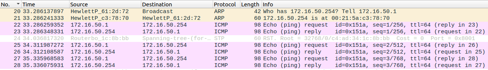

# 2.1 Configurate an IP Network

> ## Steps
> 
> 1. Conectar E0 do Tux53 e do Tux54 numa das entradas do switch;
> 2. Aceder a cada um dos computadores e configurar os seus IPs:
> 
>     ```bash
>     $ ifconfig eth0 up
>     $ ifconfig eth0 <IP>
>         - 172.16.50.1/24 para o Tux53
>         - 172.16.50.254/24 para o Tux54
>     ```
> 
> 3. Para ver o MAC address de cada computador, consultar o campo `ether` no comando `ipconfig`;
> 4. Verificar a conexão dos dois computadores na mesma rede. Em cada um tenta enviar pacotes de dados para outro. A conexão está correcta quando todos os pacotes são recebidos:
> 
>     ```bash
>     $ ping <IP> -c 20
>         - 172.16.50.254 para o Tux53
>         - 172.16.50.1 para o Tux54
>     ```
> 
> 5. Avaliar a tabela *Address Resolution Protocol* (ARP) do Tux53. Deverá ter uma única entrada com o IP e o MAC do Tux54. Para visualizar a tabela:
> 
>     ```bash
>     $ arp -a # ?(172.16.50.254) at 00:21:5a:c3:78:70 [ether] on eth0
>     ```
> 
> 6. Apagar a entrada da tabela ARP do Tux53:
> 
>     ```bash
>     $ arp -d 172.16.50.254/24
>     $ arp -a # empty
>     ```
> 
> 7. Abrir o WireShark no Tux53 e começar a capturar pacotes de rede;
> 8. Executar o seguinte comando no Tux53:
> 
>     ```bash
>     $ ping 172.16.50.254/24 -c 10
>     ```
> 
> 9. Parar a captura dos resultados e avaliar os logs obtidos com o WireShark.
> 
>     

## Questions

What are the ARP packets and what are they used for?

```note
Os pacotes ARP (*Address Resolution Protocol*) são pacotes que servem para estabelecer a ligação entre um IP e um endereço MAC.
```

What are the MAC and IP addresses of ARP packets and why?

```note
São enviados em broadcast 2 endereços IP: o da máquina de destino (172.16.50.254, Tux54) e o da máquina de origem (172.16.50.01, Tux 53) no mesmo pacote ARP. Como resposta o Tux54 envia um pacote ARP para o Tux53 que contém o seu endereço MAC, 00:21:5a:c3:78:70.
```

What packets does the ping command generate?

```note
Enquanto não obtém o endereço MAC da máquina de destino, o *ping* gera pacotes ARP. Após fazer a ligação do endereço IP ao respetivo MAC, gera pacotes do tipo ICMP (*Internet Control Message Protocol*), para transferência de informação.
```

What are the MAC and IP addresses of the ping packets?

```note
Os endereços IP e MAC usados em pacotes ICMP são os das máquinas em comunicação: Tux53 e Tux54. 
```

How to determine if a receiving Ethernet frame is ARP, IP, ICMP?

```note
A designação do protocolo de cada frame está presente na coluna "Protocol" da captura no Wireshark. Por norma o protocolo é indicado nos primeiros 2 bytes da frame, no cabeçalho.
```

How to determine the length of a receiving frame?

```note
Existe uma coluna no Wireshark que mostra o tamanho, em bytes, das frames. Por norma o cabeçalho de cada frame contém essa informação.
```

What is the loopback interface and why is it important?

```note
É uma interface virtual que é sempre alcançável desde que pelo menos uma das interfaces IP do *switch* esteja operacional. Com isto, é possível verificar periodicamente se as ligações da rede estão configuradas corretamente.
```