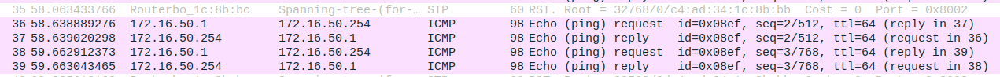
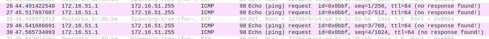

# 2.2 Implement two bridges in a switch

## Steps

> 1. Conectar Tux52_S0 em T3;
> 2. Conectar o T4 no CONSOLE do switch;
> 3. Abrir o GKTerm no Tux52 e configurar a baudrate para 115200;
> 4. Resetar as configurações do switch com o seguinte comando:
> 
>     ```bash
>     > admin
>     > /system reset-configuration
>     > y
>     ```
> 
> 5. Conectar o Tux52_E0 ao switch (porta 3) e configurar a ligaçao com os seguintes comandos:
> 
>     ```bash
>     $ ifconfig eth0 up
>     $ ifconfig eth0 172.16.51.1/24
>     ```
> 
> 6. Criar 2 bridges no switch
> 
>     ```bash
>     > /interface bridge add name=bridge50
>     > /interface bridge add name=bridge51
>     ```
> 
> 7. Eliminar as portas as quais o Tux52, 53 e 54 estao ligados por defeito
> 
>     ```bash
>     > /interface bridge port remove [find interface=ether1] 
>     > /interface bridge port remove [find interface=ether2] 
>     > /interface bridge port remove [find interface=ether3] 
>     ```
> 
> 8. Adicionar as novas portas
> 
>     ```bash
>     > /interface bridge port add bridge=bridge50 interface=ether1
>     > /interface bridge port add bridge=bridge50 interface=ether2 
>     > /interface bridge port add bridge=bridge51 interface=ether3
>     ```
> 
> 9. Verificar que as portas foram adicionadas corretamente com o commando :
> 
>     ```bash
>     > /interface bridge port print
>     ```
> 
> 10. Começar a captura do eth0 do Tux53
> 
> 11. Desde o Tux53, começar a captura do eth0 e fazer ping do Tux54 e Tux52
>     ```bash
>     $ ping 172.16.50.254
>     #Tux55 -> Tudo ok
>     $ ping 172.16.51.1
>     #Tux52 -> connect: Network is unreachable
>     ``` 
> 
> 12. Começar capturas do eth0 no Tux52, Tux53 e Tux54. No Tux53, executar o seguinte comando e observar e guardar os resultados:
>     ```bash
>     $ ping -b 172.16.50.255
>     ``` 
> 
> 13. Começar capturas do eth0 no Tux52, Tux53 e Tux54. No Tux52, executar o seguinte comando e observar e guardar os resultados:
>     ```bash
>     $ ping -b 172.16.51.255
>     ``` 

## Questions

How to configure bridgeY0?

```note
A bridge50 foi configurada para servir de meio de ligação entre os computadores Tux53 e Tux54, formando uma subrede. Eliminamos as configurações e ligações por omissão que o switch implementou aquando da ligação entre os computadores e configuramos novas portas/ligações a cada um dos computadores. Os comandos utilizados no processo estão disponíveis acima.
```

How many broadcast domains are there? How can you conclude it from the logs?

```note
Existem dois domínios de broadcast pois existem duas bridges implementadas. Analisando os logs, reparamos que o ping do Tux53 conseguiu resposta do Tux54 mas não do Tux52, pois estão inseridos em duas bridges diferentes.
```

Ping do Tux53



Ping do Tux52

