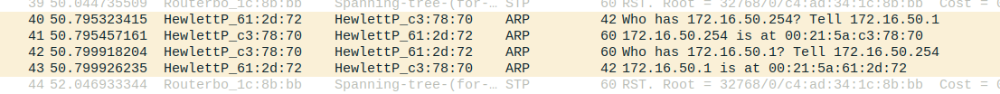
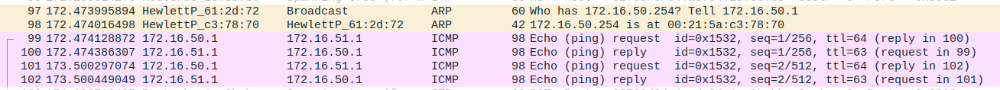

# 2.3 Configure a Router in Linux

>## Steps
>
> 1. Ligar eth1 do Tux54 à porta 4 do switch. Configurar eth1 do Tux54
> ```bash
>     ifconfig eth1 up
>     ifconfig eth1 172.16.51.253/24
> ```
> 
> 2. Eliminar as portas as quais o Tux52 esta ligado por defeito e adicionar a nova porta
> ```bash
>     /interface bridge port remove [find interface=ether4]
>     /interface bridge port add bridge=bridge51 interface=ether4
> ```
> 
> 3. Ativar *ip forwarding* e desativar ICMP no Tux54
> ```bash
>     #3 Ip forwarding t4
>     echo 1 > /proc/sys/net/ipv4/ip_forward
> 
>     #4 Disable ICMP echo ignore broadcast T4
>     echo 0 > /proc/sys/net/ipv4/icmp_echo_ignore_broadcasts
> ```
> 
> 4. Observar MAC e Ip no Tux54eth0 e Tux54eth1
> ```bash
>     ifconfig
>     ##Mac eth0 -> 00:21:5a:c3:78:70
>     ##ip eth0-> 172.16.50.254
>     ##Mac eth1 -> 00:c0:df:08:d5:b0
>     ##ip eth1-> 172.16.51.253
> ```
> 
> 5. Adicionar as seguintes rotas no Tux52 e Tux53 para que estes se consigam altançar um ou outro através do Tux54
> ```bash
>     route add -net  172.16.50.0/24 gw 172.16.51.253 # no Tux52
>     route add -net  172.16.51.0/24 gw 172.16.50.254 # no Tux53
> ```
> 
> 6. Verificar as rotas em todos os Tux com o seguinte comando:
> ```bash
>     route -n
> ```
> 
> 7. Começar captura do Tux53 no Wireshark
> 
> 8. Fazer ping aos seguintes endereços desde o Tux53
> ```bash
>     ping 172.16.50.254
>     ping 172.16.51.253
>     ping 172.16.51.1
>     ##All good, network is correct
> ```
> 
> 9. Parar a captura e guardar os resultados
> 
> 10. Começar captura do eth0 e eth1 do Tux54 no Wireshark
> 
> 11. Limpar as tabelas ARP em todos os Tux
> ```bash
>     arp -d 172.16.51.253 #Tux52
>     arp -d 172.16.50.254 #Tux53
>     arp -d 172.16.50.1 #Tux54
>     arp -d 172.16.51.1 #Tux54
> ```
> 
> 12. Fazer ping do Tux52 desde o Tux53
> 
> 13. Parar a captura e guardar os resultados

## Questions

What routes are there in the tuxes? What are their meaning?

```note
Existe uma rota no Tux52 e outra no Tux53. Ambas têm como *gateway* o Tux54 pois é o único que é comum às duas bridges criadas (router).
```

What information does an entry of the forwarding table contain? 

```note
Cada entrada contém o endereço de destino e respetivo gateway.
```

What ARP messages, and associated MAC addresses, are observed and why?

```note
Embora o ping seja do Tux53 para o Tux52, os pacotes ARP trocados contém apenas os MAC addresses do Tux53 e do Tux54 e não do destino final. Isto deve-se à implementação da rota. O endereço de Tux52 não é conhecido pelo Tux53, este apenas conhece o endereço da gateway (Tux54) que leva ao Tux52.
```



What ICMP packets are observed and why?

```note
Os pacotes ICMP contém sempre o endereço de origem (IP do Tux53) e o endereço de destino (IP do Tux52). O facto de serem observados significa que a rede esta configurada corretamente.
```



What are the IP and MAC addresses associated to ICMP packets and why? 

```note
Cada pacote ICMP observado através do ping no Tux53 contém como endereço de origem o IP do Tux53 e o endereço de destino o IP do Tux52. No entanto, esses pacotes contém o endereço MAC do Tux54, pois é o computador que faz a ligação entre as duas bridges.
```