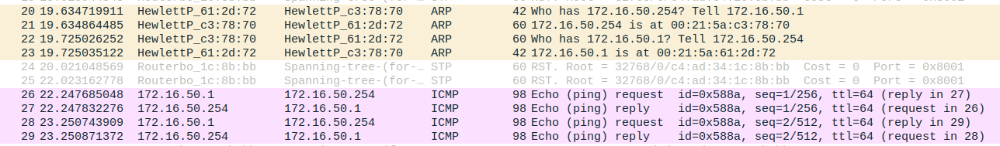
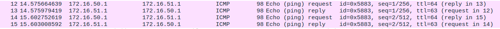
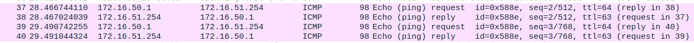
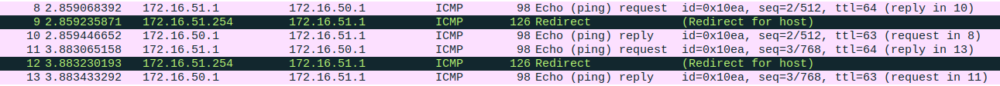

# 2.4 Configure a Commercial Router and Implement NAT

>## Steps
>
>1. Ligar eth1 do Router à porta 5.1 da régua
>
>2. Ligar eth2 to Router ao Switch
>
>3. Eliminar as portas default do ether5 do switch e ligar o ether5 à bridge51
>
>```bash
>    /interface bridge port remove [find interface=ether5]
>    /interface bridge port add bridge=bridge51 interface=ether5
>```
>
>4. Trocar o cabo ligado a consola do Switch para o Router MT
>
>5. No Tux52 conectar ao router desde o GTKterm com:
>
>```note
>    Serial Port: /dev/ttyS0
>    Baudrate: 115200
>    Username: admin
>    Password: <ENTER>
>```
>
>6. Resetar as configuraçoes do router
>
>```bash
>    /system reset-configuration
>```
>
>7. Configurar ip do Router pela consola do router no GTKterm do Tux52
>
>```bash
>    /ip address add address=172.16.1.59/24 interface=ether1
>    /ip address add address=172.16.51.254/24 interface=ether2
>```
>
>8. Configurar as rotas default nos Tuxs e no Router:
>
>```bash
>    route add default gw 172.16.51.254 # Tux52
>    route add default gw 172.16.50.254 # Tux53
>    route add default gw 172.16.51.254 # Tux54
>
>    /ip route add dst-address=172.16.50.0/24 gateway=172.16.51.253  # Router console
>    /ip route add dst-address=0.0.0.0/0 gateway=172.16.1.254        # Router console
>```
>
>9. No Tux53, começar captura do Wireshark e fazer ping de todas as interfaces. Todas deverão funcionar. Guardar o resultado obtido:
>
>```bash
>    ping 172.16.50.254 # Figura 1
>    ping 172.16.51.1   # Figura 2
>    ping 172.16.51.254 # Figura 3
>```
>
>10. No Tux52, desativar o *accept_redirects*
>
>```bash
>    echo 0 > /proc/sys/net/ipv4/conf/eth0/accept_redirects
>    echo 0 > /proc/sys/net/ipv4/conf/all/accept_redirects
>```
>
>11. Remover a rota que liga Tux52 ao Tux54
>
>```bash
>    route del -net 172.16.50.0 gw 172.16.51.253 netmask 255.255.255.0
>```
>
>12. No Tux52, começar captura do wireshark e fazer ping do Tux53. A ligação é estabelecida, usando o Rc como router em vez do Tux54. Comandos:
>
>```bash
>    ping 172.16.50.1 # Figura 4
>```
>
>13. Fazendo traceroute, conseguimos verificar o percurso da ligação
>
>```bash
>    traceroute -n 172.16.50.1
>    traceroute to 172.16.50.1 (172.16.50.1), 30 hops max, 60 byte packets
>    1  172.16.51.254 (172.16.51.254)  0.200 ms  0.204 ms  0.224 ms
>    2  172.16.51.253 (172.16.51.253)  0.354 ms  0.345 ms  0.344 ms
>    3  tux51 (172.16.50.1)  0.596 ms  0.587 ms  0.575 ms
>```
>
>14. Adicionar de novo a rota que liga Tux52 ao Tux54
>
>```bash
>    route add -net 172.16.50.0/24 gw 172.16.51.253 
>```
>
>15. No Tux52, traceroute para o Tux53  
>
>```bash
>    traceroute -n 172.16.50.1
>    traceroute to 172.16.50.1 (172.16.50.1), 30 hops max, 60 byte packets
>    1  172.16.51.253 (172.16.51.253)  0.196 ms  0.180 ms  0.164 ms
>    2  tux51 (172.16.50.1)  0.414 ms  0.401 ms  0.375 ms
>```
>
>16. No Tux52, reativar o *accept_redirects*
>
>```bash
>    echo 0 > /proc/sys/net/ipv4/conf/eth0/accept_redirects
>    echo 0 > /proc/sys/net/ipv4/conf/all/accept_redirects
>```
>
>17. No Tux53, fazer ping do router do lab I.321 para verificar a ligação
>
>```bash
>    ping 172.16.1.254
>```
>
>18. Desativar NAT do Router
>
>```bash
>    /ip firewall nat disable 0
>```
>
>19. No Tux53, fazer de novo ping do router do lab I.321 para verificar a ligação. Verifica-se que não há ligação:
>
>```bash
>    ping 172.16.1.254
>```
>
>20. Reativar Nat do Router
>
>```bash
>    /ip firewall nat enable 0
>```

## Questions

How to configure a static route in a commercial router?

```note
Resetar as suas configurações, adicioná-lo à rede interna (à bridge correspondente) e atribuir um IP interno e um IP externo.
```

What are the paths followed by the packets in the experiments carried out and why?

```note
Na primeira experiência, sem a ligação do Tux52 ao Tux54, os pacotes de dados foram reencaminhados (ICMP redirect) através do router implementado até ao endereço IP de destino <br>
Já na segunda experiência não houve qualquer reencaminhamento pois a ligação mais curta da rede estava disponível.
```









How to configure NAT in a commercial router?

```note
Com o comando `/ip firewall nat enable 0` no terminal do router
```

What does NAT do?

```note
O NAT (Network Address Translation) traduz endereços da rede local para um único endereço público, e viceversa. Assim, quando um pacote é enviado para uma rede externa, é enviado com o endereço publico como origem. Quando o computador de destino responde, envia a resposta para esse endereço público, que é depois traduzido de volta para o endereço local de destino que enviou o pacote em primeiro lugar. Deste modo, é possivel reduzir o numero de endereços publicos utilizados.
```