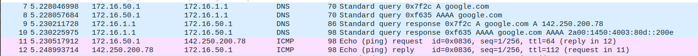

# 2.5 - DNS

>## Steps
>
>1. Em todos os Tuxs, adicionar a seguinte linha ao ficheiro /etc/resolv.conf
>
>```note
>nameserver 172.16.1.1
>```
>2. Em todos os Tux, fazer ping do google para verificar se podem ser usados nomes como host
>
>```bash
>ping google.com
>```

## Questions

How to configure the DNS service at a host?

```note
O DNS pode ser configurado adicionando a linha "nameserver <IP>" no ficheiro /etc/resolv.conf de todos os Tuxs presentes. 
```

What packets are exchanged by DNS and what information is transported?

```note
Os pacotes transportados pela rede são inicialmente do tipo DNS, para que o router identifique e traduza o endereço IP de destino.
```


