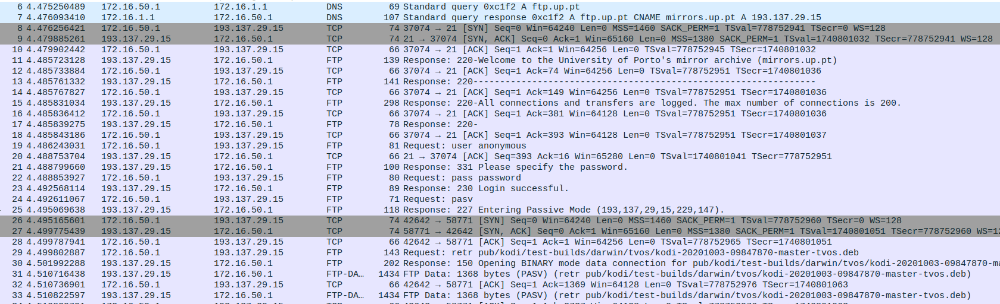
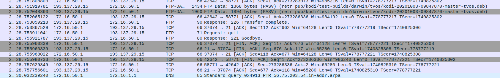
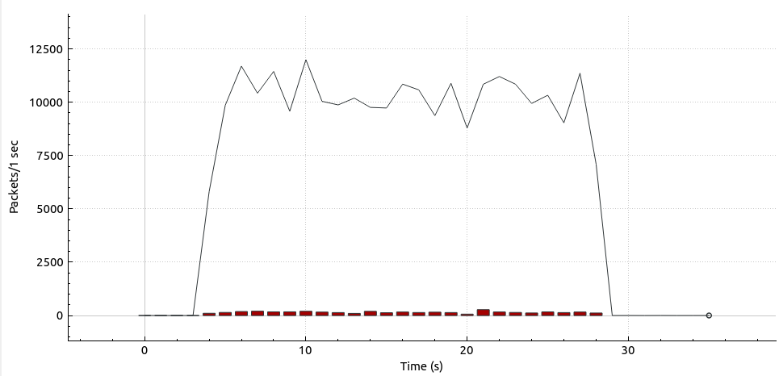
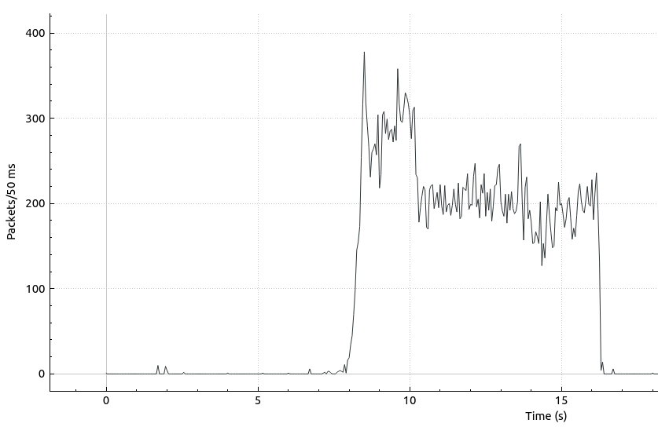

# 2.6 - TCP connections

>## Steps
>
>1. No Tux53, fazer o download de um ficheiro do servidor FTP. Guardar a captura obtida com o WireShark.
>2. No Tux53 e no Tux52, fazer o download de um ficheiro do servidor FTP ao mesmo tempo. Guardar a captura obtida com o WireShark.

## Questions

How many TCP connections are opened by your ftp application?

```note
Duas: uma para enviar comandos e outra para receber o ficheiro.
```

In what connection is transported the FTP control information?

```note
A primeira mencionada em cima, onde há transferência de comandos de controlo e recepção de mensagens do servidor.
```




What are the phases of a TCP connection?

```note
DNS, conexão (SYN ACL), configuração, transferência do ficheiro, finalização (FIN ACK).
```



How does the ARQ TCP mechanism work? What are the relevant TCP fields? What relevant information can be observed in the logs?

```note
Automatic Repeat Request serve para fazer retransmissão numa rede congestionada. Uma rede diz-se congestionada a partir do momento que se perdem pacotes. É necessário o envio de vários pacotes de uma vez (Additive Increase) até que tal aconteça. Usa-se slow start quando em vez de adicionar uma unidade à CongestionWindow em cada transmissão, usa-se o mesmo método mas em modo exponencial na base dois. A perda do pacote pode ser dada:
- Por timeout. Ocorre um Multiplicative Decrease, passando a Congestion Window a 1 e aumentando novamente até metade do valor obtido por mecanismo de slow start. A partir de metade o Additive Increase passa a ser incremental de uma unidade;
- Por 3 ACKs seguidos. Ocorre um Multiplicative Decrease, passando a Congestion Window a metade e Additive Increase passa a ser incremental de uma unidade;
```

How does the TCP congestion control mechanism work? What are the relevant fields. How did the through put of the data connection evolve along the time? Is it according the TCP congestion control mechanism?

```note
Cada emissor determina a capacidade da comunicação para poder enviar mais ou menos pacotes. Para isso há mais um parâmetro na conexão (CongestionWindow). Se o nível de congestionamento da rede aumenta a CongestionWindow diminui e vice-versa.
```

Is the throughput of a TCP data connections disturbed by the appearance of a second TCP connection? How?

```note
Sim, ao fazer mais de uma conexão TCP a largura de banda será dividida entre as multiplas ligações, reduzindo a velocidade de cada uma. 
```


